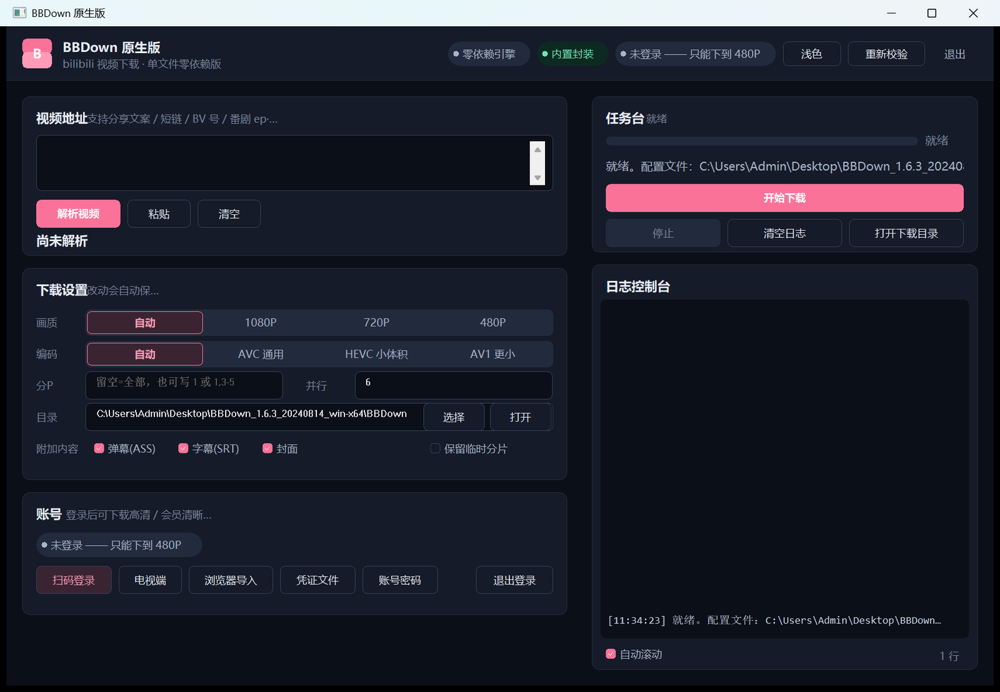
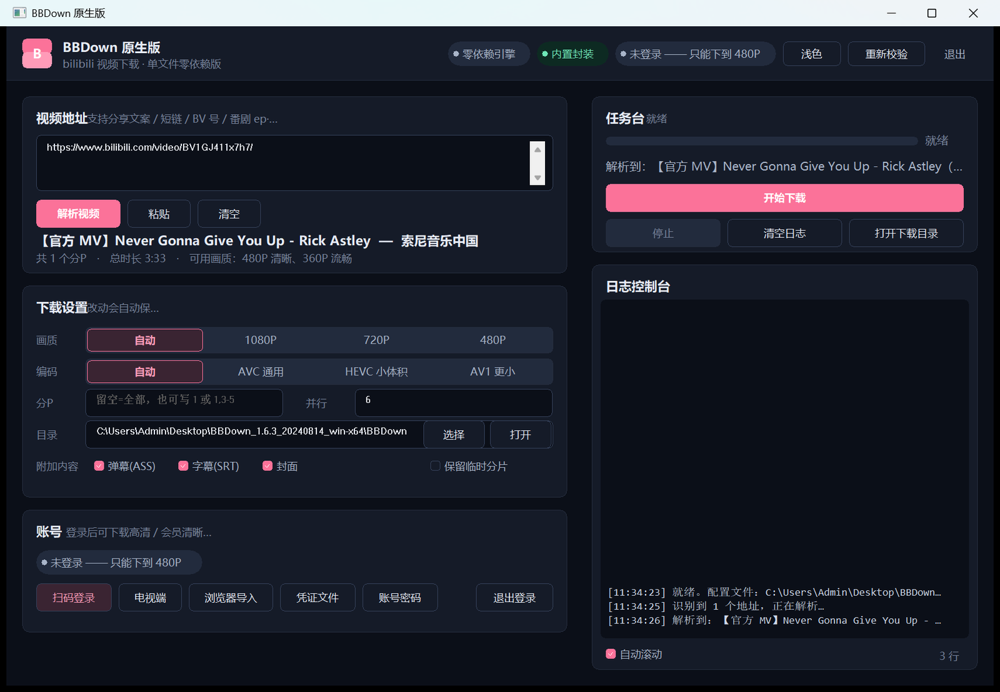
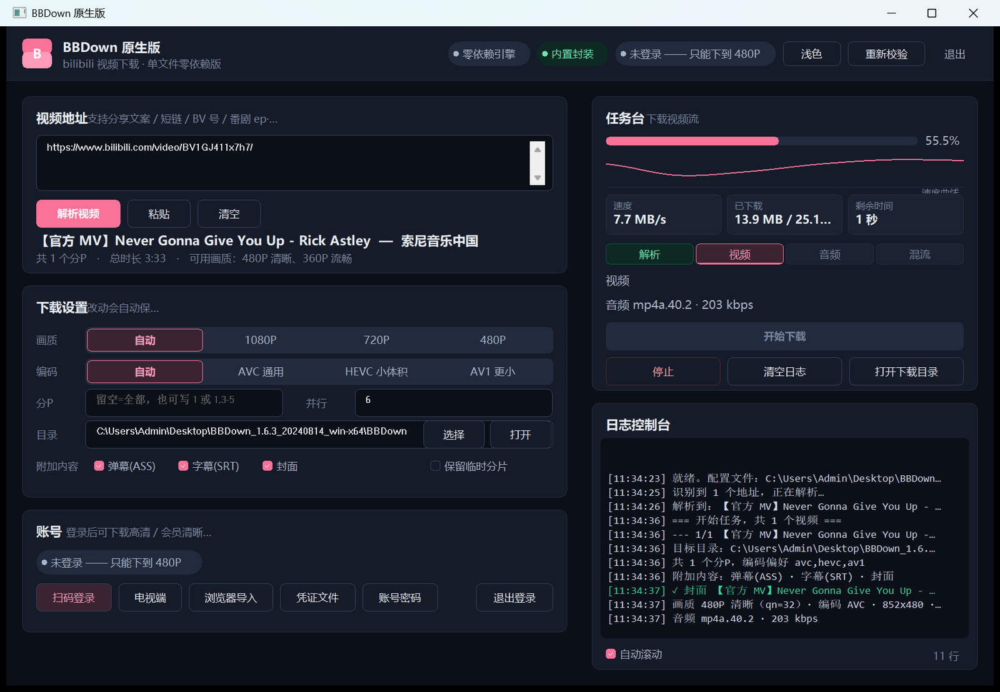

# BBDown GUI — 哔哩哔哩视频下载图形界面（三版本合集）

给命令行工具 [BBDown](https://github.com/nilaoda/BBDown) 套一层可视化操作台：
粘贴链接 → 解析 → 下载，全程在独立桌面窗口里完成，不跳浏览器、没有命令行黑窗。

本仓库包含**三个版本**：

| 版本 | 目录 | 技术 | 状态 |
| --- | --- | --- | --- |
| **原生版**（推荐） | [`BBDown-Native/`](BBDown-Native/) | 纯 Go + Win32 自绘 | 🚧 活跃开发 |
| 老版图形界面 | [`BBDown-GUI-Python/`](BBDown-GUI-Python/) | Python + pywebview + WebView2 | 已停更，可用 |
| 命令行原版 | `BBDown-CLI/` | 第三方 exe（不入库） | — |

## 运行截图（原生版）

**空闲态** —— 双击即用，单文件零依赖：



**解析完成** —— 标题、UP主、时长、可用画质完整分行显示：



**下载中** —— 空心平滑速度曲线、速度 / 已下载 / 剩余时间三张指标卡、
解析→视频→音频→混流阶段步进器、实时日志：



## 原生版（BBDown-Native）

**单文件 exe，零运行时依赖**：不需要 Python、WebView2、浏览器，也不强制 ffmpeg
（内置封袋方案直接封装 mp4，无需外部混流工具）。

### 功能

- **地址解析**：支持分享文案 / 短链 / BV 号 / 番剧 ep·ss，一段话里多个地址依次下载
- **下载设置**：画质优先级、编码优先级（默认 AVC 通用，规避 B 站客户端播放 HEVC 全黑问题）、
  分 P 范围（支持 `1,3-5` 写法）、并行数、仅视频/仅音频/弹幕/字幕/封面
- **任务台**：实时进度条、**空心平滑速度曲线**、速度 / 已下载 / 剩余时间指标卡、
  **阶段步进器**（解析→视频→音频→混流）、常驻阶段行、实时日志（自动滚动开关 + 行数统计）
- **四种登录**：网页扫码（二维码直接画在窗口里）/ 电视端 / 浏览器导入 / 凭证文件
- **浅色 / 深色双主题**，一键切换，偏好记忆
- **mp4 封装质量**：与 `ffmpeg -c copy` 参照做三级 framecrc diff 全零对齐（有测试锁定）

### 构建

```bash
cd BBDown-Native
source tools/goenv.sh   # 配置 Go 环境（Windows）
go build -trimpath -ldflags "-s -w -H=windowsgui" -o "dist/BBDown原生版.exe" ./cmd/bgui
```

要求：Go 1.22+，无任何第三方依赖（纯标准库 + golang.org/x/sys）。

### 测试与验证

```bash
go test ./...          # 全量单元测试（含 mp4 封装、编码偏好防回退等）
go run ./cmd/e2e       # 端到端接口测试（加 -url 带网跑真实下载）
node tools/uitest.mjs  # 界面冒烟
```

## 老版图形界面（BBDown-GUI-Python）

Python + pywebview 实现，功能更早落地（分 P 勾选列表、aria2c 加速、交互式选清晰度等）。
**已停更**，仅作存档；使用方式见 [`BBDown-GUI-Python/BBDown-GUI/README.md`](BBDown-GUI-Python/BBDown-GUI/)。
双击 `BBDown 图形界面.exe` 即可运行（需同目录有 BBDown.exe 与 ffmpeg，均在 Release 附件/官方仓库获取）。

## 下载

前往 [Releases](https://github.com/amo-tx/BBDown-GUI/releases) 获取打包好的 exe：

- **BBDown-Native-vX.Y.Z.exe** — 原生版（推荐）
- **BBDown-GUI-Python-vX.Y.Z.exe** — 老版

## 安全说明

- 原生版本地服务只监听 `127.0.0.1`，等同本地程序；写接口带自定义头做 CSRF 防护
- 登录凭据明文保存在 exe 同目录的 `config.json` / `*.data`（与 BBDown 官方行为一致），
  **请勿把这两个文件分享给任何人**；本仓库 `.gitignore` 已在任意层级忽略它们
- 仓库推送前有三道凭据扫描（文件名 / diff 内容 / 远端树复核），`config.json`、`BBDown.data`
  及其改名变体一律不入库

## 目录结构

```
.
├─ BBDown-Native/          # Go 原生版（活跃开发）
│  ├─ cmd/bgui/            #   程序入口
│  ├─ internal/gui/        #   Win32 自绘界面（布局 + 绘制）
│  ├─ internal/app/        #   任务调度、配置
│  ├─ internal/bilibili/   #   B 站接口（解析、登录、画质选择）
│  ├─ internal/mp4/        #   纯 Go mp4 封装
│  ├─ internal/server/     #   本地 HTTP 接口（标准库）
│  ├─ tools/               #   截图 / GUI 自动化验证脚本
│  └─ dist/                #   构建产物（不入库）
├─ BBDown-GUI-Python/      # 老版 Python GUI（存档）
├─ BBDown-CLI/             # 原版命令行（不入库，凭据所在）
├─ downloads/              # 共享下载目录
├─ tools/ffmpeg/           # ffmpeg（老版用；原生版不需要）
└─ docs/screenshots/       # README 运行截图
```

## License

仅供学习交流，请遵守 B 站用户协议，勿用于商业用途。
